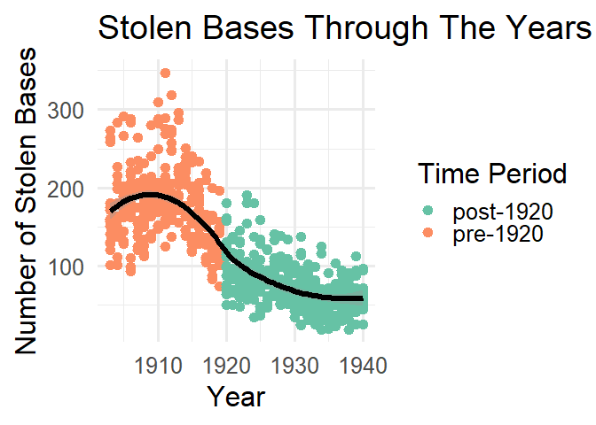
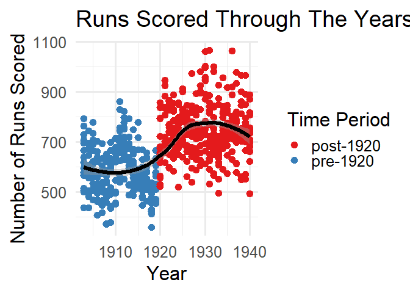
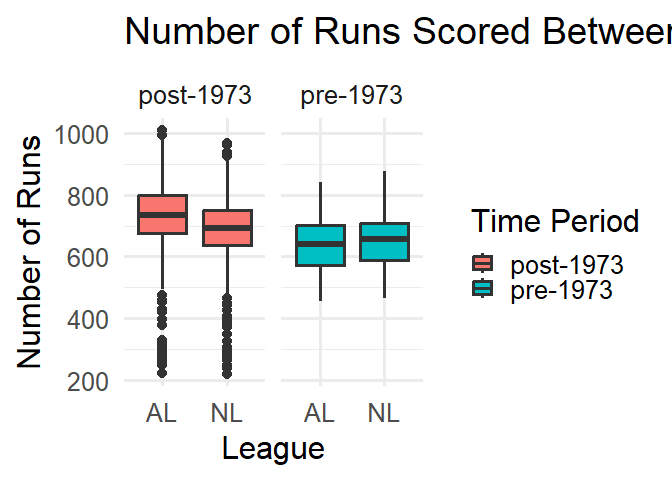
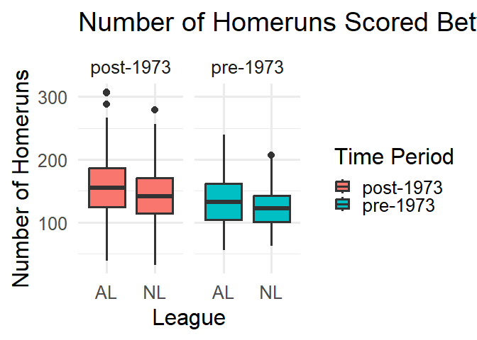

# How Rule Changes in Baseball Affected The Game in History


``` r
library(readr)
library(ggplot2)
library(tidyverse)
```

    ── Attaching core tidyverse packages ──────────────────────── tidyverse 2.0.0 ──
    ✔ dplyr     1.1.4     ✔ stringr   1.6.0
    ✔ forcats   1.0.1     ✔ tibble    3.3.0
    ✔ lubridate 1.9.4     ✔ tidyr     1.3.1
    ✔ purrr     1.2.0     
    ── Conflicts ────────────────────────────────────────── tidyverse_conflicts() ──
    ✖ dplyr::filter() masks stats::filter()
    ✖ dplyr::lag()    masks stats::lag()
    ℹ Use the conflicted package (<http://conflicted.r-lib.org/>) to force all conflicts to become errors

``` r
library(dplyr)
mlb_teams <- read_csv("data-finalProject/mlb_teams.csv")
```

    Rows: 2784 Columns: 41
    ── Column specification ────────────────────────────────────────────────────────
    Delimiter: ","
    chr  (8): league_id, division_id, division_winner, wild_card_winner, league_...
    dbl (33): year, rank, games_played, home_games, wins, losses, runs_scored, a...

    ℹ Use `spec()` to retrieve the full column specification for this data.
    ℹ Specify the column types or set `show_col_types = FALSE` to quiet this message.

``` r
Baseball <- mlb_teams |> select(1:2, 13, 18, 20, 21, 35) |> slice(261:2784)

stolen_bases <- Baseball |> filter(year <= "1940") |>
mutate(period = if_else(year < 1920, "pre-1920", "post-1920"))

designated_hitter <- Baseball |> filter(year >= "1961") |>
  mutate(period = if_else(year < 1973, "pre-1973", "post-1973"))

Pitcherstrikezone <- Baseball |> select(1,7) 

pitcherstrikeouts <- Pitcherstrikezone |> drop_na() |> group_by(year) |> summarise(Total = sum(strikeouts_by_pitchers)) 
```

## Data

The mlb_teams dataset used it from openintro linked here:
https://www.openintro.org/data/index.php?data=mlb_teams) looks at every
professional team that exists or has existed from 1876 to 2020 with
various numerical and categorical variables on each team’s performance.

I sliced the dataset to only include world series years (1903-2020) and
selected variables of interest: year, league_id, runs_scored, homeruns,
stolen_bases and strikeouts_by_pitchers.

## Questions

Baseball has been a professional sport in America for 150 years and has
experienced MANY rule changes either to improve the game or define the
game more, these rules changes made a lasting impact on how players
played baseball

How did some of the biggest rule changes in the history of baseball
affect the game?:

    1) Abolition of Spitball (1920)
    2) Introduction of a Designated Hitter (1973)
    3) Strike zone shifts with mound reduction (1963 and 1969)

## Rule Change \#1: Abolition of Spitball

Abolition of spitball led to a decrease in stolen bases and a increases
in runs scored per year

``` r
ggplot(data = stolen_bases, aes(x = year, y = stolen_bases, colour = period)) +
  geom_point() +
  geom_smooth(color = "black") +
  labs(title = "Stolen Bases Through The Years 1903 - 1940",
       x = "Year",
       y = "Number of Stolen Bases",
       colour = "Time Period") +
  scale_color_brewer(palette = "Set2") +
  theme_minimal(base_size = 24)
```

    `geom_smooth()` using method = 'loess' and formula = 'y ~ x'



``` r
runs_scored <- Baseball |> filter(year <= "1940") |>
  mutate(period = if_else(year < 1920, "pre-1920", "post-1920"))

ggplot(data = runs_scored, aes(x = year, y = runs_scored, colour = period)) +
  geom_point() +
  geom_smooth(color = "black") +
  labs(title = "Runs Scored Through The Years 1903 - 1940",
       x = "Year",
       y = "Number of Runs Scored",
       colour = "Time Period") +
  scale_color_brewer(palette = "Set1") +
  theme_minimal(base_size = 24)
```

    `geom_smooth()` using method = 'loess' and formula = 'y ~ x'



## Rule Change \#2: Introduction of a Designated Hitter

Introduction of a Designated Hitter led to the AL league to have more
runs scored and home runs than the NL

``` r
ggplot(data = designated_hitter, aes(x = league_id, y = runs_scored, fill = period)) +
  geom_boxplot() +
  facet_wrap(~period) +
  labs(title = "Number of Runs Scored Between Each League",
       x = "League",
       y = "Number of Runs",
       fill = "Time Period") +
  theme_minimal(base_size = 24)
```



``` r
ggplot(data = designated_hitter, aes(x = league_id, y = homeruns, fill = period)) +
  geom_boxplot() +
  facet_wrap(~period) +
  labs(title = "Number of Homeruns Scored Between Each League",
       x = "League",
       y = "Number of Homeruns",
       fill = "Time Period") +
  theme_minimal(base_size = 24)
```



## Rule Change \#3: Strike zone changes

Strike zone change in 1963 to favor pitchers by that led to “Year of the
Pitcher” 1968-1969 so it change again in 1969 with the mound reducing
form 15 inches to 10 inches to help batters more

## More Analysis

A Shiny App is also available to look at all any team of interest (with
their years of existence) with any numerical variable from the original
dataset.
